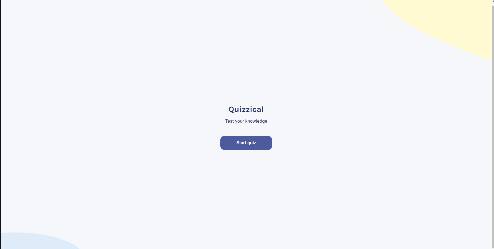
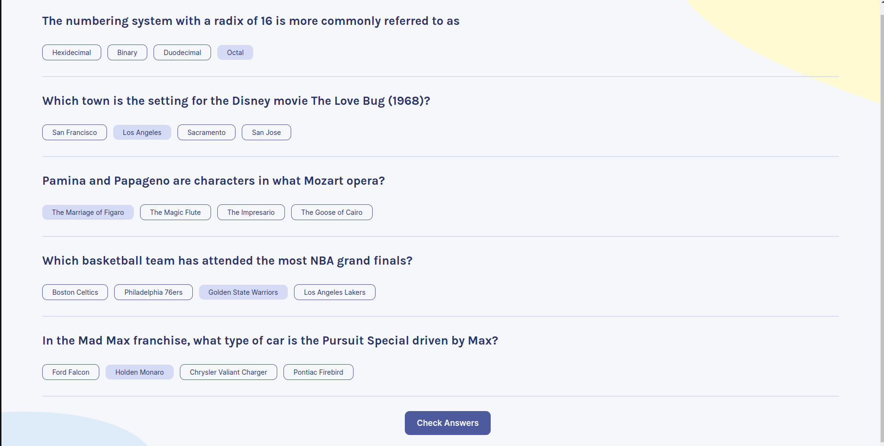
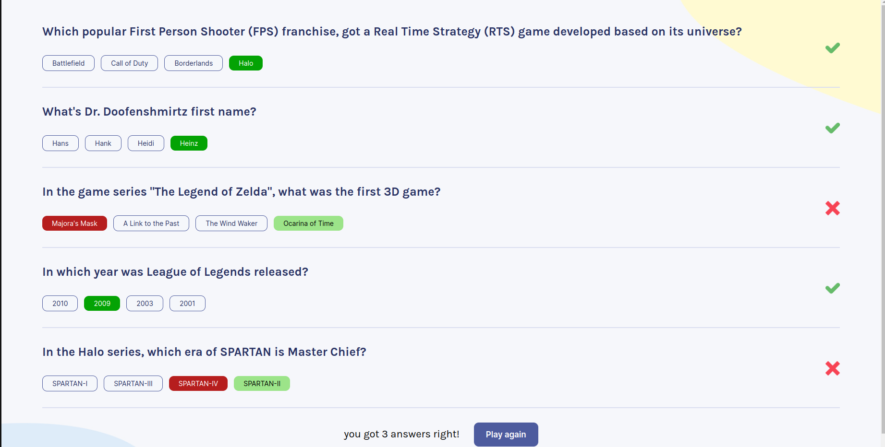

# quizzical 🤔

Quiz WebApp that access trivia questions from the [Open Trivia Database API](https://opentdb.com/) and score players based on their answers.

## Built with 🛠
Javascript, HTML, CSS, React js

## Screenshots 📷 

